# Lab8Web

## Nama: Bagus aditya hermawan
## Nim: 312410382
## Kelas: TI.24.A.3
## Mata Kuliah: Pemrograman Web 1

## Langkah-langkah praktikum

### 1. Menjalankan MySQL Server
Buka XAMPP Control
###### 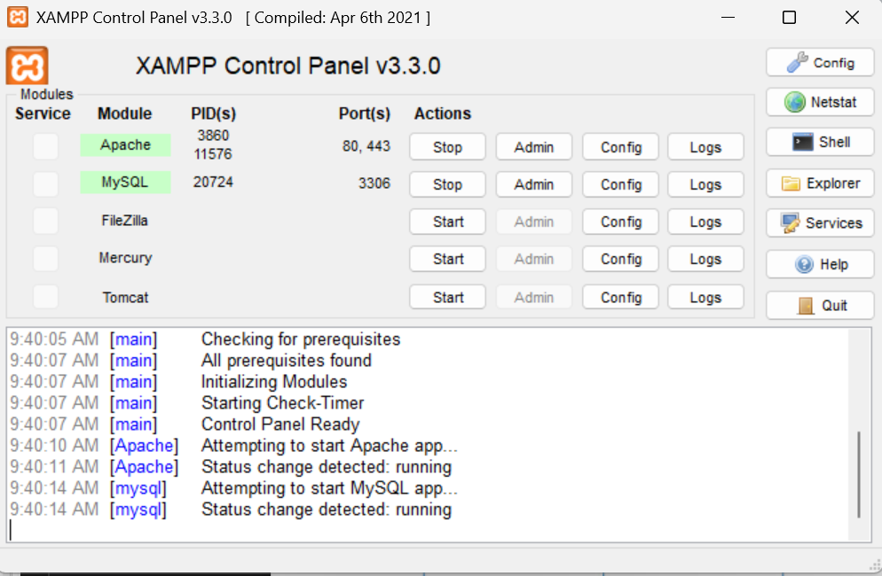

### 2. Mengakses MySQL Client menggunakan PHP MyAdmin
Buka melalui browser: http://localhost/phpmyadmin/.

### Membuat Database: Studi Kasus Data Barang
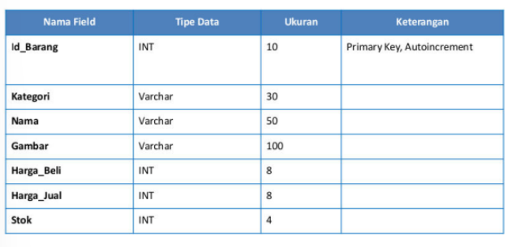

### Membuat Database
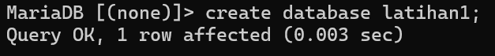

### Membuat Tabel
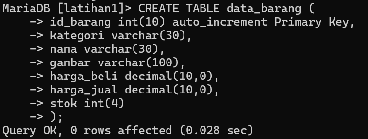

### Tampilan phpMyAdmin
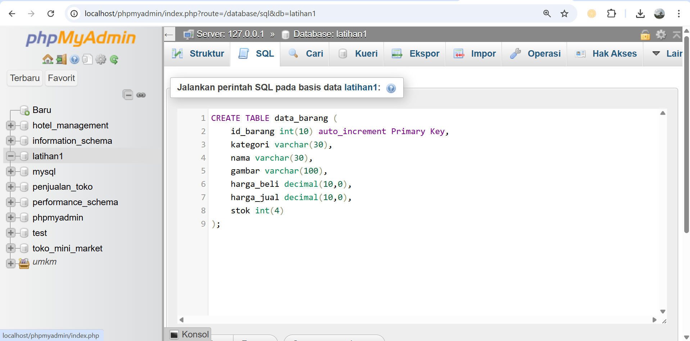

### Menambahkan data
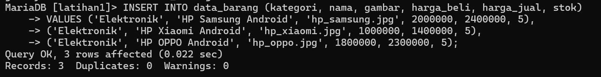

### Tampilan Data
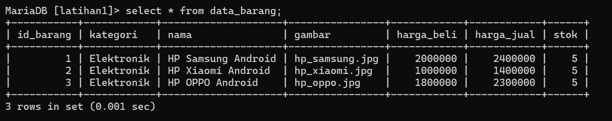

### 3. Membuat Program CRUD
Buat folder lab8_php_database pada root directory.

###### 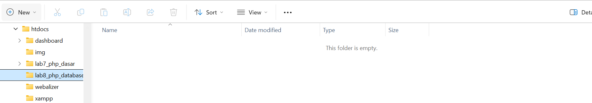

Kemudian untuk mengakses direktory tersebut pada web server dengan mengakses URL:
http://localhost/lab8_php_database/.
Tampilan web:

###### 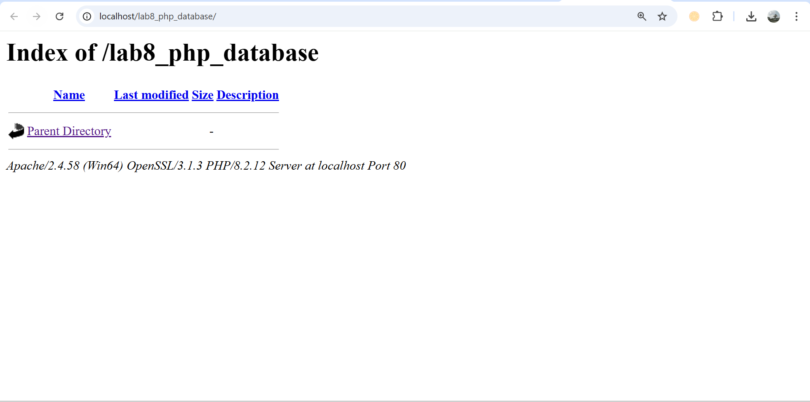

Membuat file koneksi database dan buat file dengan nama koneksi.php.

###### 

Lalu buka melalui browser untuk menguji koneksi database untuk menampilkan pesan
koneksi berhasil, uncomment pada perintah echo “koneksi berhasil”;.

###### 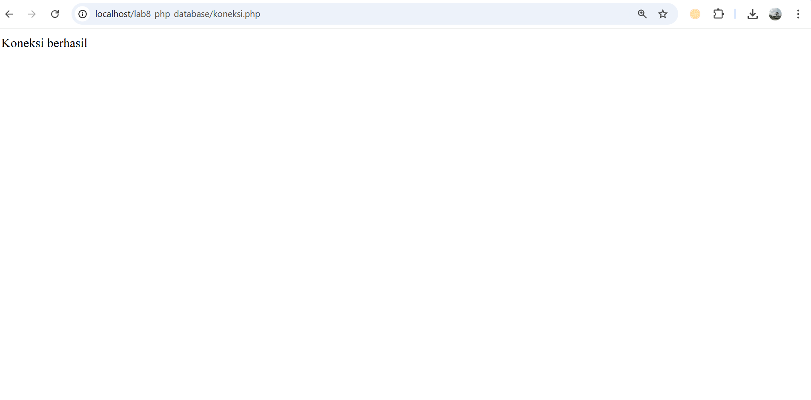

Membuat file index untuk menampilkan data (Read).
Buat file baru dengan nama index.php

###### 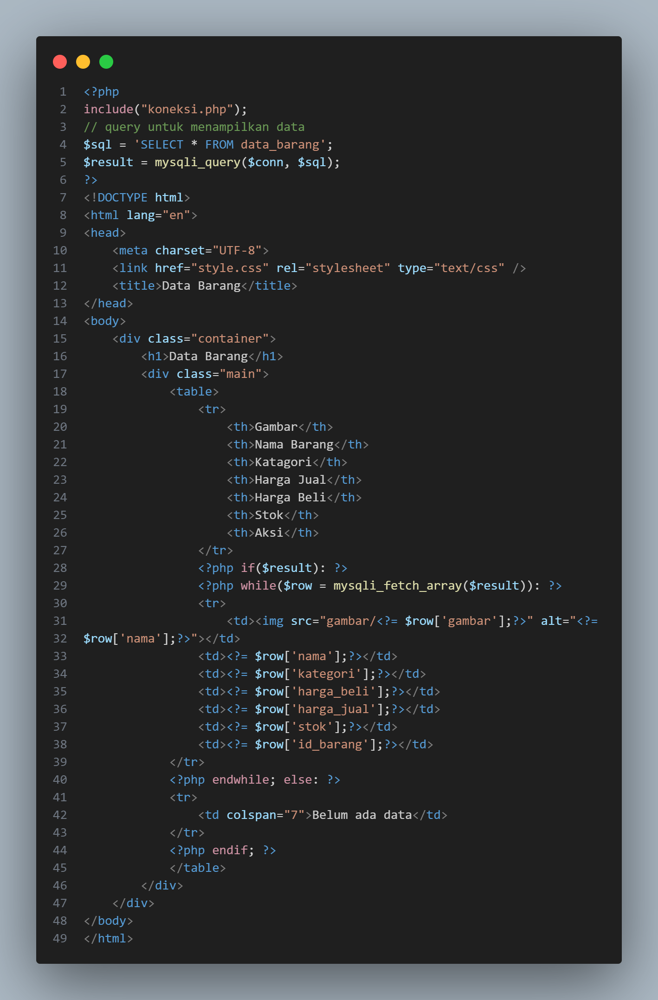

Tampilan index.
###### 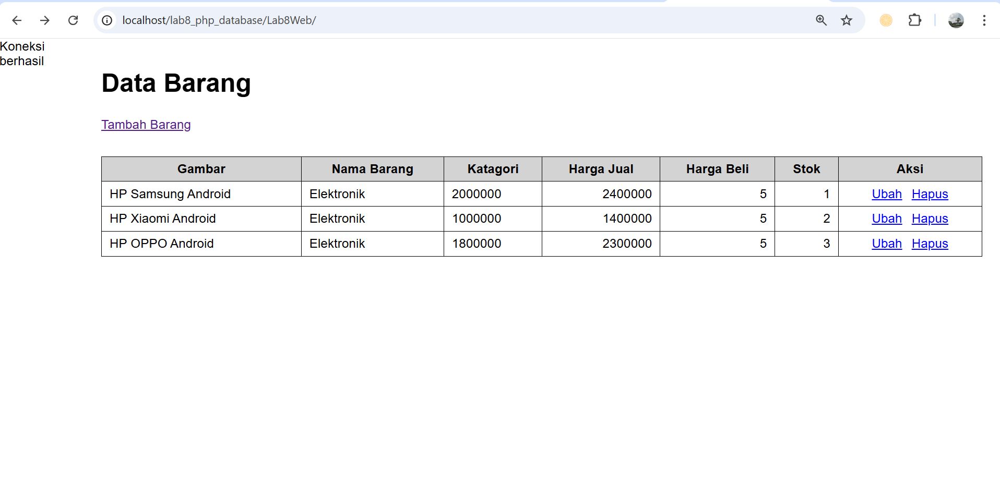

Menambah Data.
Buat file baru dengan nama tambah.php
###### 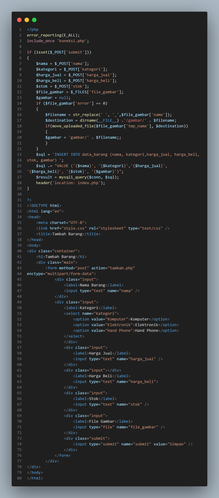

Tampilan tambah barang.
###### 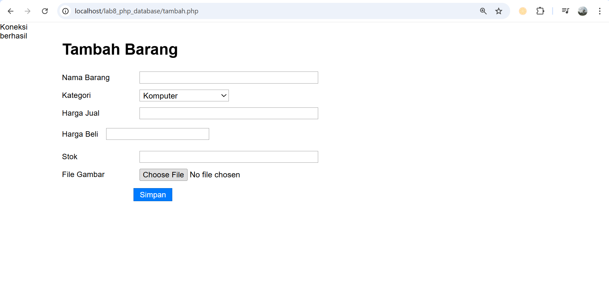

Mengubah Data (Update)
Buat file baru dengan nama ubah.php.
###### 

Tampilan ubah barang.
###### 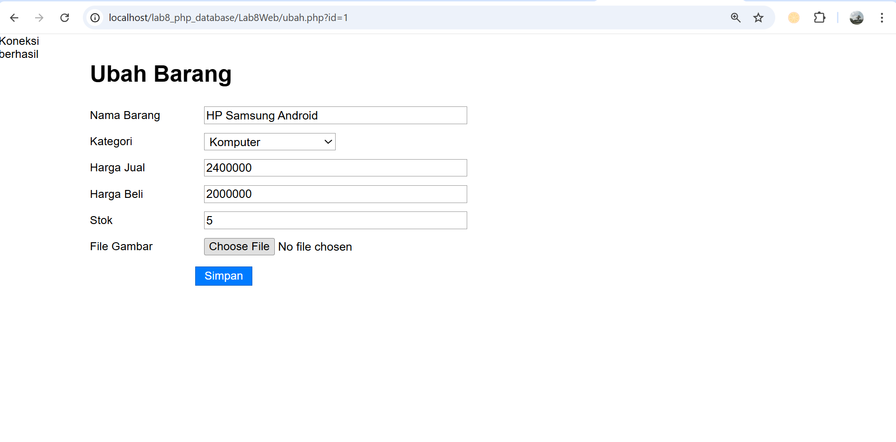

Menghapus Data (Delete)
Buat file baru dengan nama hapus.php.
###### 